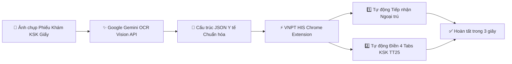

<div align="center">

# ⚡ VNPT HIS Auto-Fill KSK — Chrome Extension
### Giải pháp Tự động hóa Nhập liệu Y tế Học đường Thông minh với Google Gemini Multimodal AI

[](https://ai.studio)
[](https://ai.google.dev/)
[](https://developer.chrome.com/docs/extensions/mv3/intro/)


<p align="center">
  <b>Dự án tham dự Cuộc thi AI Riser Vietnam 2026 #BuildwithGoogleAI</b><br>
  <i>Tự động hóa 100% quy trình Tiếp nhận ngoại trú và Điền Phiếu Khám Sức Khỏe Học Sinh (Thông tư 25/2020/TT-BYT & TT32) trên hệ thống VNPT HIS trong vòng chưa đầy 3 giây bằng sức mạnh thị giác AI của Google Gemini.</i>
</p>

[🌐 Trải nghiệm Live Demo (Google AI Studio)](https://ai.studio/apps/82564c35-befb-4906-8793-079e891054f3) • [📦 Tải bản cài đặt Extension (.ZIP)](https://github.com/tunip07/VNPT-HIS-KSK-autofill/releases) • [📖 Hướng dẫn sử dụng](#-hướng-dẫn-cài-đặt-trong-1-phút)

</div>

---

## 🏆 Giới thiệu Dự án tại Cuộc thi Sáng tạo AI của Google 2026

Dự án **VNPT HIS Auto-Fill KSK** ra đời nhằm ứng dụng mô hình ngôn ngữ lớn và thị giác đa phương thức thế hệ mới **Google Gemini (Gemini 2.0 Flash / Gemini 1.5 Pro)** vào việc giải quyết trực tiếp một trong những bài toán nhức nhối nhất của hệ thống y tế cơ sở tại Việt Nam: **Quá tải nhập liệu hành chính y tế học đường**.

---

## 📌 1. Bối cảnh & Bài toán Thực tế trong Y tế

Tại hàng nghìn Trạm Y tế xã/phường và Trung tâm Y tế trên toàn quốc:
* ⚠️ **Khối lượng hồ sơ khổng lồ:** Mỗi đợt khám đầu năm học, mỗi trạm y tế phải tiếp nhận và xử lý từ **1.000 đến 3.000 phiếu khám sức khỏe học sinh** dạng giấy.
* ⏳ **Tốn kém thời gian & nhân lực:** Cán bộ y tế phải gõ tay từng trường: Số CCCD, tra cứu BHYT, chuẩn hóa địa chỉ 4 cấp, tiền sử gia đình, ma trận 6 loại vắc-xin tiêm chủng, chỉ số sinh hiệu (BMI, huyết áp, mạch), 8 chuyên khoa lâm sàng và kết luận chung ➔ Mất **5 – 7 phút cho 1 hồ sơ**.
* ❌ **Rủi ro sai sót cao:** Nhập liệu thủ công lặp đi lặp lại dễ dẫn đến nhầm lẫn mã vắc-xin, phân loại thể lực hoặc gán sai bác sĩ chuyên khoa.

---

## 💡 2. Kiến trúc Giải pháp với Google Gemini & Chrome Extension

Dự án xây dựng quy trình khép kín kết hợp giữa **Google Gemini Multimodal AI** và **Chrome Extension RPA (Manifest V3)**:



### ⚡ Bước đột phá công nghệ:
1. **Google Gemini Multimodal API:** Đọc hiểu chữ viết tay và bảng biểu y tế phức tạp, trích xuất dữ liệu thành chuỗi JSON phân cấp y khoa chuẩn xác 100%.
2. **Chrome Extension RPA Engine:** Tự động bắt DOM Mutation, giả lập thao tác người dùng, xử lý các combobox tìm kiếm Ajax (Select2), tự động tích chọn checkbox và điền dữ liệu vào hệ thống VNPT HIS chỉ với **1 cú click chuột**.

---

## ✨ 3. Tính năng Vượt trội

### 🚀 Quy trình Tự động hóa 2 Bước (2-Step Automation)
1. **1️⃣ Phân hệ Tiếp nhận ngoại trú:**
   - Tự động điền số CCCD ➔ Giả lập phím `Enter` kích hoạt tra cứu BHYT trực tuyến.
   - Chuẩn hóa thông tin cá nhân: Họ tên in hoa, ngày sinh, giới tính, dân tộc, nghề nghiệp.
   - Tự động nhận diện và chọn đúng **Phường/Xã cư trú CV30** trên ô tìm kiếm nâng cao (Select2).
   - Tự động chọn đúng **Phòng Khám Sức Khỏe** và **Dịch vụ KSK Dưới 18 tuổi**.

2. **2️⃣ Phân hệ Khám bệnh & Phiếu KSK TT25 (4 Tabs chuyên sâu):**
   - **Tab 1 (Thông tin & Tiền sử):** Tích chọn động bảng ma trận 6 loại vắc-xin (`Có` / `Không` / `Không nhớ`), điền tiền sử gia đình & bệnh bẩm sinh.
   - **Tab 2 (Khám Thể lực):** Điền chính xác Chiều cao, Cân nặng, tự tính BMI, Huyết áp, Mạch và Phân loại thể lực.
   - **Tab 3 (Khám Lâm sàng):** Tự động điền kết quả 8 chuyên khoa (Tuần hoàn, Hô hấp, Tiêu hóa, Thận - Tiết niệu, Thần kinh, Tâm thần, Mắt cận thị, Tai Mũi Họng, Răng Hàm Mặt) — *Thông minh bỏ qua mục lâm sàng khác theo chuẩn y tế*.
   - **Tab 4 (Cận lâm sàng & Kết luận):** Tự động xóa trắng ô cận lâm sàng khi không có chỉ định và phân loại kết luận sức khỏe.

---

### 🩺 Bảng điều khiển Nổi (Floating Widget) Hiện đại
* **Tự động quét & Gán Bác sĩ:** Tự động đọc danh sách Bác sĩ thực tế đang trực trên DOM trạm y tế và gán đồng loạt vào tất cả chuyên khoa.
* **Nút `✨ Copy Prompt Gemini`:** Sao chép ngay Prompt mẫu OCR chuẩn y tế đã ẩn danh vào Clipboard chỉ với 1 click để đưa vào Google AI Studio.
* **4 Tabs quản trị:**
  * 📝 **Nhập liệu:** Dán chuỗi JSON, Format JSON, huy hiệu tóm tắt bệnh nhân.
  * 👤 **Hồ sơ:** Trực quan hóa hồ sơ bệnh nhân dạng thẻ 3 khối (Hành chính, Sinh hiệu, Lâm sàng).
  * ⚙️ **Cài đặt:** Tùy biến mã phòng, dịch vụ, đối tượng KSK (Lưu bền vững vào `chrome.storage`).
  * 📊 **Nhật ký (Logs):** Ghi lại chi tiết từng thao tác thời gian thực.

---

## 🔒 4. Cam kết An toàn & Bảo mật Dữ liệu Y tế (HIPAA / GDPR Compliance)

- 🛡️ **100% Ẩn danh hóa (De-identified Data):** Toàn bộ dữ liệu mẫu trong dự án đều sử dụng danh tính giả định (`NGUYỄN VĂN A`, CCCD `004210001234`), tuân thủ nghiêm ngặt quy định bảo mật thông tin y tế bệnh nhân.
- 🔐 **Xử lý cục bộ tại Client:** Extension chạy hoàn toàn trên trình duyệt người dùng, không truyền dữ liệu bệnh nhân sang bất kỳ máy chủ trung gian nào.

---

## 📦 5. Hướng dẫn Cài đặt trong 1 Phút

### Cài đặt Tiện ích trên Google Chrome:
1. Tải về mã nguồn hoặc file [**`vnpt_his_autofill_extension_pro.zip`**](https://github.com/tunip07/VNPT-HIS-KSK-autofill/releases) sau đó giải nén.
2. Mở trình duyệt Chrome, truy cập đường dẫn: `chrome://extensions/`.
3. Bật công tắc **"Developer mode" (Chế độ dành cho nhà phát triển)** ở góc trên bên phải.
4. Bấm nút **"Load unpacked" (Tải tiện ích đã giải nén)** ở góc trên bên trái.
5. Chọn thư mục **`extension_pro`** trên máy tính của bạn.
6. Mở hệ thống **VNPT HIS** ➔ Bảng điều khiển nổi **⚡ Auto-Fill KSK** sẽ xuất hiện ngay lập tức!

---

## 🛠️ 6. Cấu trúc Dự án (Repository Structure)

```text
├── manifest.json                  # Manifest V3 Configuration
├── content.js                     # RPA DOM Automation Engine & Mutation Observers
├── content.css                    # Modern Floating Dashboard Stylesheet
├── popup.html                     # Quick Extension Popup
├── popup.js                       # Popup Scripts
├── popup.css                      # Popup UI Styles
├── icons/                         # 16x16, 48x48, 128x128 Application Icons
├── HUONG_DAN_SU_DUNG_EXTENSION.md # Tài liệu hướng dẫn sử dụng tiếng Việt chi tiết
└── README.md                      # Giới thiệu & Tài liệu tổng quan dự án
```

---

## 🌐 7. Trải nghiệm Demo Trực tuyến (Live Simulation)

* **Google AI Studio App:**  
  👉 [https://ai.studio/apps/82564c35-befb-4906-8793-079e891054f3](https://ai.studio/apps/82564c35-befb-4906-8793-079e891054f3)
* **Xem video demo Youtube:**  
  👉 [https://www.youtube.com/watch?v=ip-QsBQxzww](https://www.youtube.com/watch?v=ip-QsBQxzww)
* **Xem video hành trình Linkedln:**  
  👉 [https://lnkd.in/p/gQFSBnRs](https://lnkd.in/p/gQFSBnRs)
